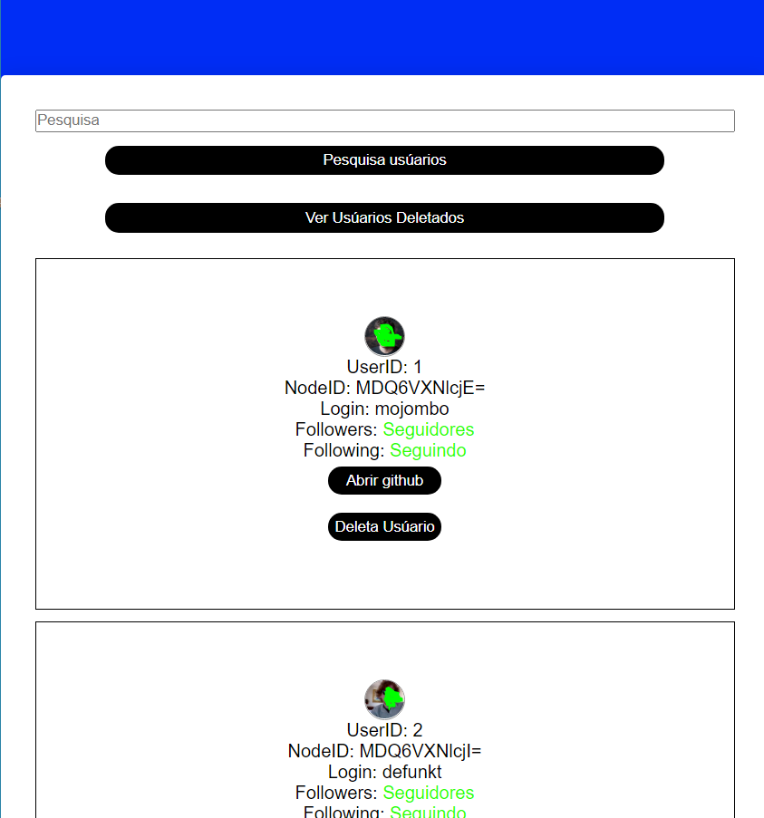
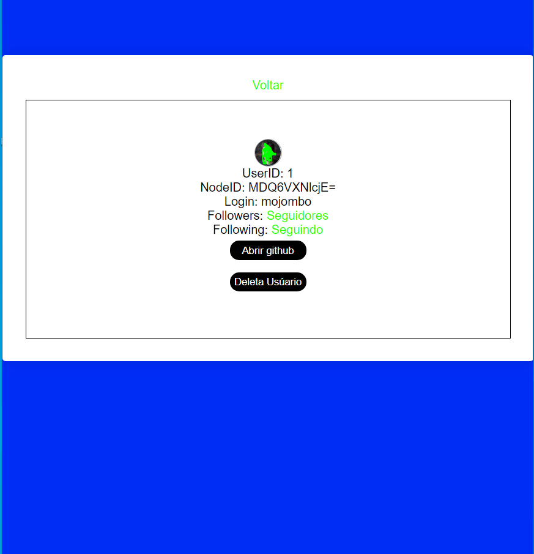
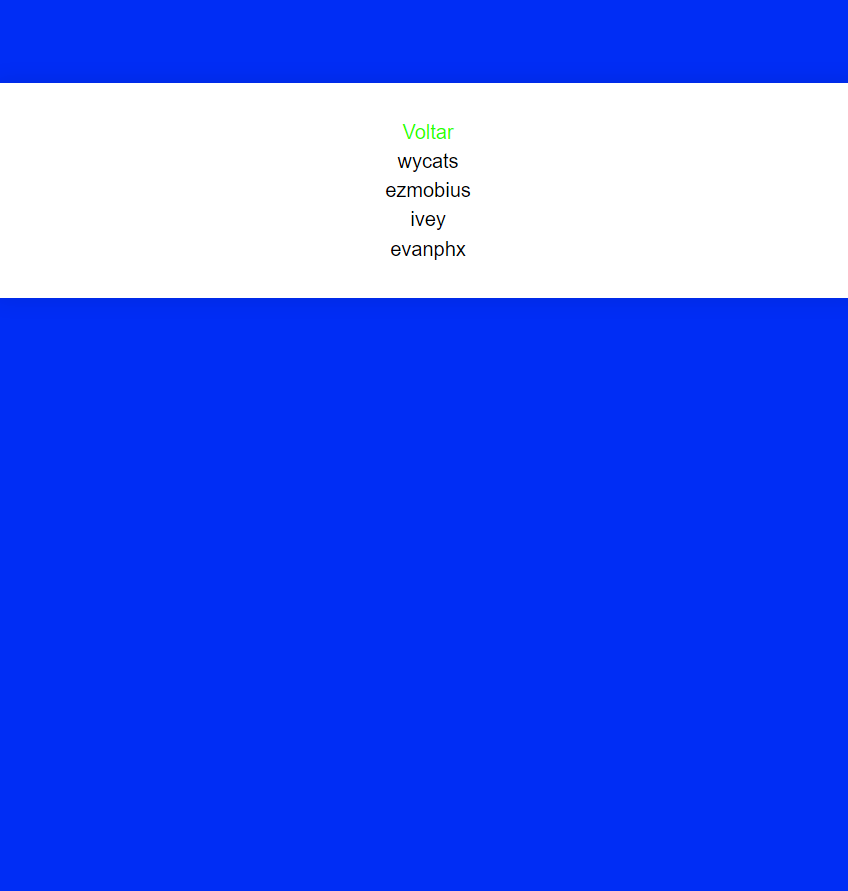

# 🚀 Sobre o desafio
---
Criei uma aplicação do zero utilizando Webpack, Babel, Webpack Dev Server e ReactJS.

Nessa aplicação eu desenvolvi um consumidor de api aonde aplicação traz alguns dados de usúario do github

a seguir algumas imagens retirada da aplicação
---

---

---

# 📝 Licença 

Esse projeto está sob a licença MIT. Veja o arquivo LICENSE para mais detalhes.

---

Feito com ♥ by Gabriel 👋 